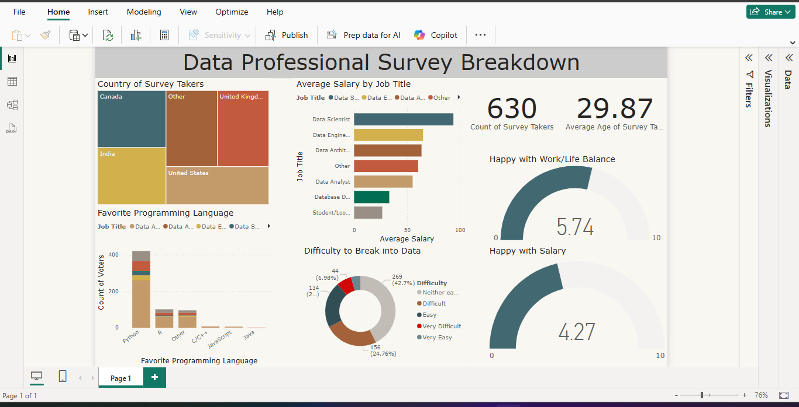

# 💼 Data Professional Survey Dashboard

This Power BI project visualizes and analyzes responses from a 630-participant survey of data professionals. The dashboard provides insights into job titles, salaries, career satisfaction, work-life balance, tool preferences, and more—helping identify trends and key takeaways from the data career landscape.

---

## 📸 Dashboard Preview

---

## 🔍 Project Summary

**Objective:**  
To transform raw survey data into a visually engaging, interactive dashboard for exploring the experiences and compensation of data professionals across countries, roles, and skill sets.

**Key Features:**
- Cleaned and standardized salary data
- Calculated average salaries
- Gauges for satisfaction with salary and work-life balance
- Breakdown of favorite programming languages
- Country-level salary filtering via tree map
- Survey count and average age cards

**Tools Used:**
- Power BI (DAX, data transformation, visuals)
- Tree maps, gauge charts, stacked bar charts, cards, and pie charts

---

## 🚀 Insights Discovered

- **Data scientists** reported the highest average salary.
- **Python** was the most popular programming language.
- Average satisfaction with **salary** was lower than with **work-life balance**.

